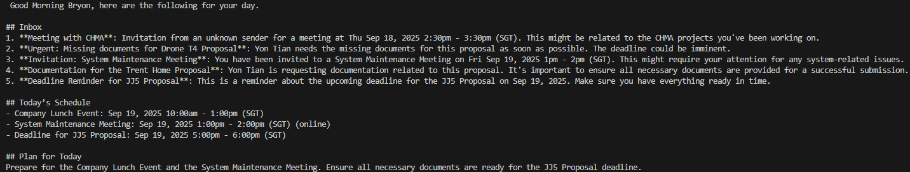

### Inbox + Calendar Summariser (Gmail + Google Calendar + LLM)

A tiny Python toolchain that:
- reads recent Gmail messages,
- fetches Google Calendar events for a chosen window,
- stitches both into prompt templates, and
- asks a local LLM (Ollama) to produce helpful summaries (and a conflict check). 

Features
- OAuth helper with a “superset” of sensible scopes and token caching. (auth.py)
- Gmail inbox fetcher (read-only; returns from, subject, id) using lightweight metadata. (getMail.py)
- Calendar fetcher for today, 2weeks, or 2months, defaulting to Asia/Singapore time and printing a readable timeline. (getCalendar)
- LLM wrapper using Ollama (e.g., mistral) to generate the summaries from your prompt templates. (getResponse)
- Main driver that loads two prompt files—prompts/summary.md and prompts/conflict.md—fills placeholders, and prints the two LLM outputs. (main.py)

Prerequisites
- Python 3.10+ (recommended; zoneinfo is used by Calendar code) 
- Google Cloud OAuth client (client_secret_*.json)
- Ollama installed locally (and a pulled model, e.g. mistral) for getResponse.py. 

Configuration
1) OAuth / tokens
Edit auth.py to point to your OAuth client JSON (or pass arguments when you call get_creds). The helper requests a superset of common scopes and caches tokens in token.json. First run: a browser window opens; the refresh token is stored for reuse. (auth.py)

2) Scopes
- Gmail read: https://www.googleapis.com/auth/gmail.readonly
- Calendar read: https://www.googleapis.com/auth/calendar.readonly
- (Optionally) send mail / edit calendar are present in SCOPES_ALL to be expanded later. (auth.py)

3) Prompts
Create two prompt files used by main.py:
- prompts/summary.md
- prompts/conflict.md (Next Stage)

They can contain placeholders:
{today_date}
{emails_text}
{calendar_text}

main.py safely fills only the keys you pass and leaves unknown braces untouched. 

Troubleshooting

Token has wrong scopes
If you initially authenticated with fewer scopes, delete token.json and re-run auth.py to mint a token that matches your needs. (auth.py)

Ollama not found / model missing
Install Ollama, run it, and ollama pull mistral (or whichever you set in getResponse.py). 

No Calendar events printing
Ensure the time window actually contains events; getCalendar_v2 prints a count and items for the selected mode. (getCalendar.py)

Gmail results empty
The current fetcher queries INBOX only and returns the latest messages; adjust max_results or add a query filter (e.g., labels) if required. (getMail.py)

### LLM Example Response in Markdown

Image Text is as follows...

 Good Morning Bryon, here are the following for your day.

## Inbox
1. **Meeting with CHMA**: Invitation from an unknown sender for a meeting at Thu Sep 18, 2025 2:30pm - 3:30pm (SGT). This might be related to the CHMA projects you've been working on.
2. **Urgent: Missing documents for Drone T4 Proposal**: Yon Tian needs the missing documents for this proposal as soon as possible. The deadline could be imminent.
3. **Invitation: System Maintenance Meeting**: You have been invited to a System Maintenance Meeting on Fri Sep 19, 2025 1pm - 2pm (SGT). This might require your attention for any system-related issues.
4. **Documentation for the Trent Home Proposal**: Yon Tian is requesting documentation related to this proposal. It's important to ensure all necessary documents are provided for a successful submission.
5. **Deadline Reminder for JJ5 Proposal**: This is a reminder about the upcoming deadline for the JJ5 Proposal on Sep 19, 2025. Make sure you have everything ready in time.

## Today’s Schedule
- Company Lunch Event: Sep 19, 2025 10:00am - 1:00pm (SGT)
- System Maintenance Meeting: Sep 19, 2025 1:00pm - 2:00pm (SGT) (online)
- Deadline for JJ5 Proposal: Sep 19, 2025 5:00pm - 6:00pm (SGT)

## Plan for Today
Prepare for the Company Lunch Event and the System Maintenance Meeting. Ensure all necessary documents are ready for the JJ5 Proposal deadline.

Future Plans
- Craft and send email using  Google API on user's behalf
- Accept or Decline Calendar Invites using Google Calendar API
- Add a API for weather data
- Craft a markdown list of functions for the LLM model with description and parameters
- Craft more markdown prompts for use cases (Outing like walk in the park, holiday overseas, etc)
